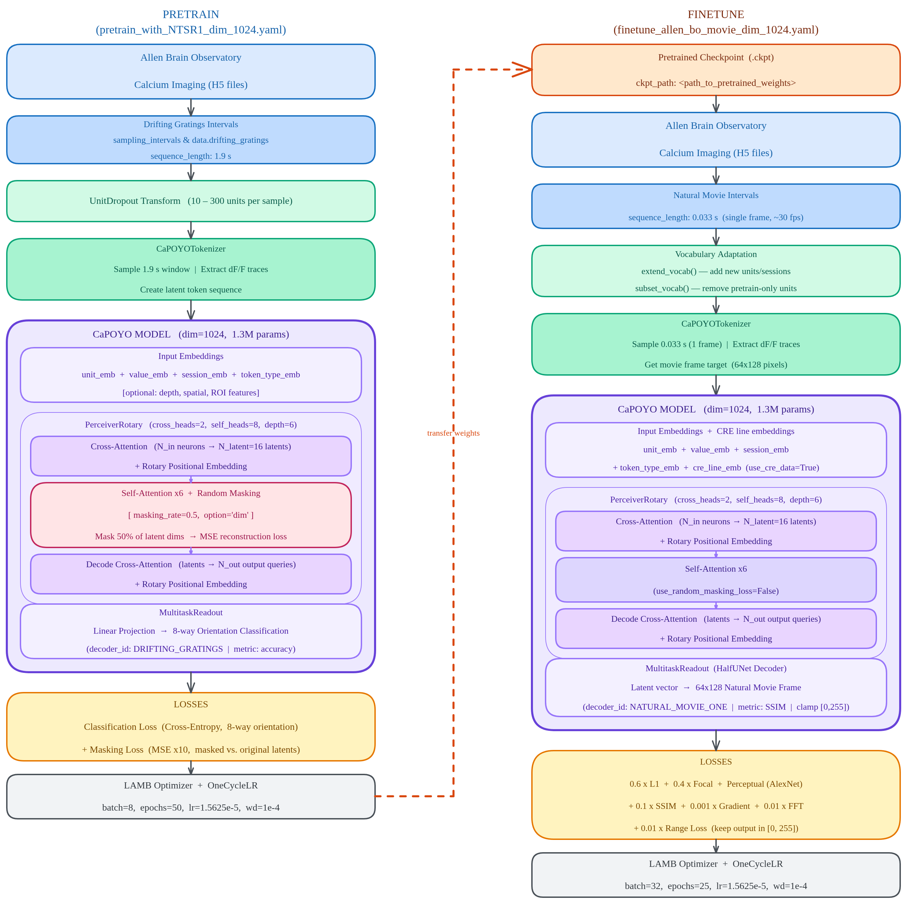

<div align="center">


# POYO-CAP

### Decoding Dynamic Visual Experience from Calcium Imaging via Cell-Pattern-Aware Pre-training

[](https://openreview.net/forum?id=z9kAjjRejs)
[](https://arxiv.org/abs/2510.18516v2)
[](https://www.python.org/)
[](https://pytorch.org/)
[](https://lightning.ai/)

**Sangyoon Bae · Mehdi Azabou · Blake Richards · Jiook Cha**

*Seoul National University · Columbia University (ARNI) · Mila, Quebec AI Institute*

✉ [stellasybae@snu.ac.kr](mailto:stellasybae@snu.ac.kr)

</div>

---

## Overview

Neural recordings exhibit a distinctive form of heterogeneity: the same dataset mixes **statistically regular neurons** (inhibitory interneurons, modulatory cells) with **highly stochastic, stimulus-contingent ones** (excitatory pyramidal cells). Training SSL models indiscriminately on this mixed signal destabilizes representation learning and limits scaling.

**POYO-CAP** (Cell-pattern Aware Pretraining) resolves this by turning heterogeneity into a curriculum:

1. **Pretrain** a POYO+ encoder on *predictable* neurons — identified a priori via per-neuron skewness & kurtosis (≤ 3.51 / ≤ 22.62) — using **masked latent reconstruction** (50 % causal mask) and a lightweight drifting-gratings cross-entropy auxiliary loss (λ = 0.01). The four selected CRE lines are **SST, VIP, PVALB, and NTSR1** (134 sessions, 80 K samples).
2. **Finetune** on *unpredictable* CRE-line neurons (299 sessions, 1.17 M samples) with a vision-specialized **Skip-Connection UNet decoder** to reconstruct natural movie frames end-to-end.

This curriculum yields **12–13 % relative SSIM improvement** over from-scratch training and enables smooth, monotonic model scaling — unlike baselines that plateau or destabilize.

---

## Overall Framework

<div align="center">

<br/>
<em><b>Figure 1.</b> (a) Pretraining on predictable CRE-line traces with masked reconstruction + drifting-gratings supervision. (b) Task-specific finetuning with unpredictable traces via Skip-Connection UNet (complex tasks) or POYO+ decoder (simple tasks). (c) UNet architecture replacing encoder skip connections with latent projections.</em>
</div>

---

## Key Insight: Loss Landscape

<div align="center">

<br/>
<em><b>Figure 2.</b> Masked reconstruction loss landscapes projected onto the first two PCs. Predictable neurons (left) yield a smooth, convex-like surface; unpredictable neurons (right) produce a rugged, multi-minima landscape — 138× rougher.</em>
</div>

---

## Training Pipeline

<div align="center">

<br/>
<em>Config-level data flow for pretraining (left) and finetuning (right).</em>
</div>

---

## Results

**Table 3** from the camera-ready paper (mean ± 95 % CI, 3 seeds, paired t-test p < 0.05):

| Method | Pretrain Data | Movie SSIM ↑ | DG Accuracy ↑ |
|--------|--------------|--------------|---------------|
| **POYO-CAP (Ours)** | Predictable | **0.593 ± 0.013** | **0.555 ± 0.022** |
| Baseline: Train on All | N/A (From Scratch) | 0.528 ± 0.023 | 0.492 ± 0.041 |
| Inhibitory-only SSL | Inhibitory | 0.544 ± 0.030 | 0.537 ± 0.025 |
| Reverse SSL | Unpredictable | 0.489 ± 0.032 | 0.213 ± 0.037 |
| Mixed SSL | Unpred. + partial Pred. | 0.543 ± 0.049 | 0.313 ± 0.012 |

**Data quality** (Table 2): Predictable neurons carry **1.93× more Fisher Information** per data point (64.51 vs. 33.47), yielding a **1.98× data quality ratio** over unpredictable populations.

---

## Installation

```bash
git clone https://github.com/<your-org>/POYO-CAP.git
cd POYO-CAP

# 1. Install conda build tools
conda install -c conda-forge gcc c-compiler cxx-compiler

# 2. Install PyTorch (CUDA 12.1)
pip install xformers==0.0.24 torch==2.2.0 torchvision==0.17.0 torchaudio==2.2.0 \
    --index-url https://download.pytorch.org/whl/cu121

# 3. Install remaining dependencies
pip install -r requirements.txt
```

---

## Data Preparation

Data: [Allen Brain Observatory](https://observatory.brain-map.org/visualcoding) two-photon calcium imaging (13 CRE driver lines, mouse visual cortex).

| Split | CRE Lines | Sessions | Samples | Selection Criterion |
|-------|-----------|----------|---------|---------------------|
| Pretrain | SST, VIP, PVALB, NTSR1 | 134 | 80,146 | skewness ≤ 3.51, kurtosis ≤ 22.62 |
| Finetune | remaining 9 lines | 299 | 1,170,931 | skewness > 3.51, kurtosis > 22.62 |

```bash
cd data/

# Step 1 — download raw sessions via Allen SDK (may take several hours)
python download_data.py --output_dir /path/to/raw

# Step 2 — process into kirby H5 format (train/val/test splits)
python prepare_data.py \
    --input_dir  /path/to/raw \
    --output_dir /path/to/processed
```

Splits: drifting gratings 70/10/20 (trial-level), natural movie one 80/10/10 (trial-level). Pretraining and finetuning animals are strictly non-overlapping (CRE-line partition).

---

## Training

All training is driven by `train.py` with [Hydra](https://hydra.cc/) configs. Hardware used in the paper: 4 × V100 (KISTI).

### Pretrain

```bash
# Single node (auto-detects GPUs)
python train.py \
    --config-name pretrain_with_NTSR1_dim_1024.yaml \
    data_root=/path/to/processed

# SLURM (4 GPUs, 48 h) — edit data_root inside the script first
sbatch scripts/pretrain_dim_1024.slurm
```

Key hyperparameters (`configs/pretrain_with_NTSR1_dim_1024.yaml`):

| Parameter | Value | Note |
|-----------|-------|------|
| `epochs` | 50 | — |
| `batch_size` | 8 | per GPU |
| `base_lr` | 1.5625e-5 | OneCycleLR, 50 % warmup |
| `sequence_length` | 1.9 s | drifting gratings window |
| `masking_rate` | 0.5 | 50 % causal mask on latent tokens |
| `use_random_masking_loss` | `True` | masked reconstruction objective |

Pretraining loss: **L₁(Z_masked, Z) + 0.01 · CrossEntropy(DG_pred, DG_true)**

### Finetune

```bash
python train.py \
    --config-name finetune_allen_bo_movie_dim_1024.yaml \
    data_root=/path/to/processed \
    ckpt_path=/path/to/pretrained.ckpt

# SLURM (4 GPUs, 48 h)
sbatch scripts/finetune_dim_1024_movie.slurm
```

Key hyperparameters (`configs/finetune_allen_bo_movie_dim_1024.yaml`):

| Parameter | Value | Note |
|-----------|-------|------|
| `epochs` | 25 | — |
| `batch_size` | 32 | per GPU |
| `sequence_length` | 0.033 s | single frame (~30 fps) |
| `use_random_masking_loss` | `False` | masking disabled |
| `use_cre_data` | `True` | CRE line embeddings enabled |
| `output_activation` | `clamp` | output range [0, 255] |

Finetuning loss: **50·Focal + 50·L₁ + 50·FFT + Perceptual + 0.1·SSIM**

> **Gradient loss (optional):** `kirby/nn/multitask_readout.py` includes an additional `GradientLoss` term (edge-alignment penalty) that is active by default in the code but was not part of the reported results in the paper. Feel free to keep it or remove it — it's yours to experiment with.

### Evaluation only

```bash
python train.py \
    --config-name finetune_allen_bo_movie_dim_1024.yaml \
    data_root=/path/to/processed \
    ckpt_path=/path/to/finetuned.ckpt \
    eval_only=true \
    eval_batch_size=64
```

---

## Model Configuration

The 1.3M-parameter POYO-CAP model uses a [POYO+](https://arxiv.org/abs/2407.09430) backbone with rotary positional embeddings:

```yaml
# configs/model/capoyo1.3M_pretrain_dim_1024_masking_ratio_50.yaml
dim: 1024
num_latents: 16
depth: 6
cross_heads: 2
self_heads: 8
ffn_dropout: 0.2
lin_dropout: 0.4
atn_dropout: 0.2
```

Input token: `unit_emb + value_emb(dF/F) + session_emb + token_type_emb`  
Finetune adds: `+ cre_line_emb`

Optimizer: **LAMB** (sparse gradients for unit/session embeddings) + **OneCycleLR** (50 % warmup).

---

## Logging

```bash
export WANDB_PROJECT=poyo_cap
python train.py --config-name pretrain_with_NTSR1_dim_1024.yaml ...
```

TensorBoard logs → `logs/lightning_logs/` (default). W&B activated by setting `WANDB_PROJECT`.

---

## Repository Structure

```
POYO-CAP/
├── train.py                              # main entry point (Hydra)
├── requirements.txt
├── configs/
│   ├── pretrain_with_NTSR1_dim_1024.yaml
│   ├── finetune_allen_bo_movie_dim_1024.yaml
│   ├── model/
│   │   ├── capoyo1.3M_pretrain_dim_1024_masking_ratio_50.yaml
│   │   └── capoyo1.3M_finetune_movie_dim_1024.yaml
│   └── dataset/
│       ├── allen_brain_observatory_calcium_pretrain.yaml
│       └── allen_brain_observatory_calcium_finetune_movie.yaml
├── scripts/
│   ├── pretrain_dim_1024.slurm
│   └── finetune_dim_1024_movie.slurm
├── data/
│   ├── download_data.py                  # Allen SDK downloader
│   └── prepare_data.py                   # NWB → kirby H5 format
├── docs/
│   ├── Fig overall framework.png
│   └── Fig Loss Landscape.png
└── kirby/
    ├── models/capoyo.py                  # POYO-CAP model + tokenizer
    ├── nn/                               # perceiver, loss functions, UNet
    ├── data/                             # dataset, sampler, collate
    ├── taxonomy/                         # task / subject / decoder registry
    ├── transforms/                       # UnitDropout, etc.
    └── utils/train_wrapper.py            # Lightning module
```

---

## Citation

```bibtex
@inproceedings{baedecoding,
  title={Decoding Dynamic Visual Experience from Calcium Imaging via Cell-Pattern-Aware Pretraining},
  author={Bae, Sangyoon and Azabou, Mehdi and Richards, Blake Aaron and Cha, Jiook},
  booktitle={The Fourteenth International Conference on Learning Representations}
}
```
